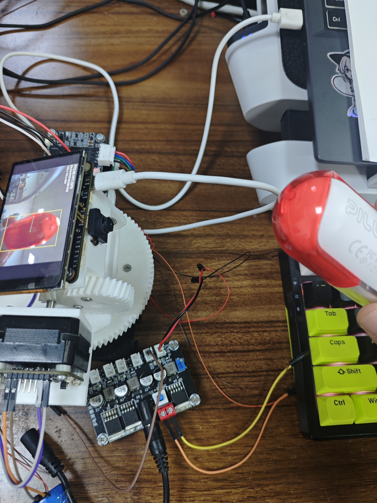
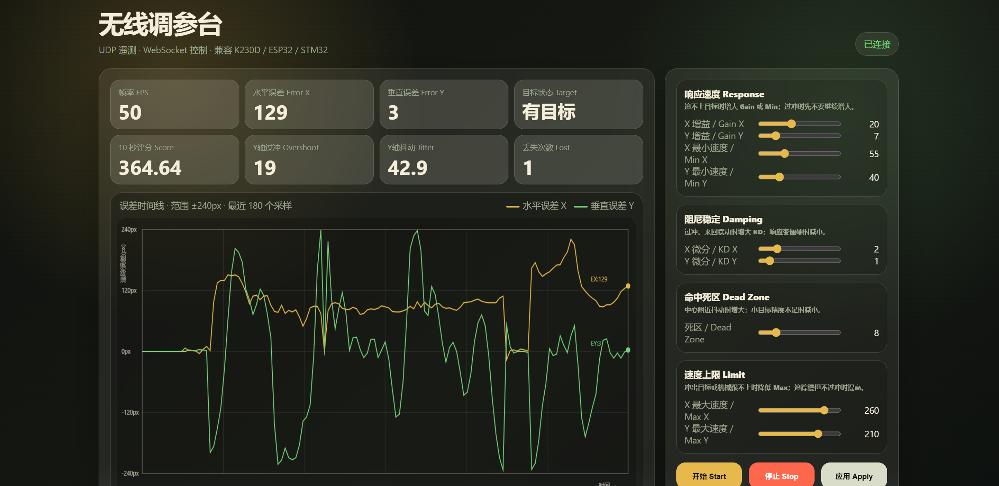
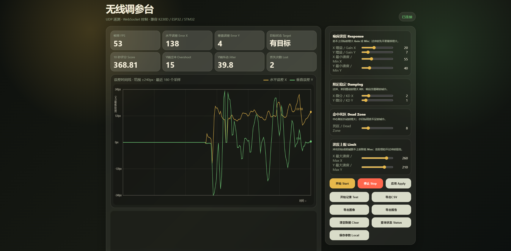

# 庐山派 Lite K230D CanMV 阶段性评测报告

> 本报告按《庐山派 Lite-K230D 开发板评测规则-20260602》的要求整理，记录开发板学习、基础例程测试、AI Demo 验证、DIY 项目开发、问题排查与阶段性建议。

## 1. 评测目标与整体结论

本次评测围绕庐山派 Lite K230D CanMV 开发板展开，目标是验证其作为 AI 视觉与边缘控制开发板的综合能力。测试内容覆盖 CanMV IDE 使用、MicroPython 基础例程、摄像头、ST7701 屏幕、WiFi、UART、PWM、ADC、音频、RGB LED、蜂鸣器、按键、AI 手势识别，以及基于视觉追踪的两轴云台 DIY 项目。

阶段性结论：

- 基础外设综合测试 10/10 通过，常用板载与扩展资源可正常调用。

- 摄像头、ST7701 本地显示、多路 UART、WiFi 遥测可以在同一项目中组合使用。

- K230D 可以运行官方手势识别模型，但 Web 视频推流、AI 推理和多模态任务同时叠加时会明显影响实时性。

- 当前展示方向是“本地视觉处理 + ST7701 显示 + UART 云台控制 + PC 网页调参”。

  

## 2. 开发板与测试环境

| 项目 | 内容 |
| --- | --- |
| 开发板 | 庐山派 Lite K230D CanMV 开发板 |
| 主控 | Kendryte K230D |
| 固件 | CanMV v1.6-50-g297b646，`k230d_canmv_lushanpi_lite` |
| 摄像头 | GC2093 CSI 摄像头 |
| 显示屏 | ST7701，800x480 |
| 无线网络 | RTL8189FTV，2.4GHz WiFi |
| 电机驱动 | 张大头 X42_V1.3 闭环步进驱动，Emm V5 UART 协议 |
| 供电 | K230D USB 供电，电机驱动使用独立 12V 稳压供电，并与 K230D 共地 |
| 上位机 | PC 端 Python 标准库桥接服务 + 浏览器网页调参界面 |
| 主要语言 | CanMV MicroPython、Python、HTML/CSS/JavaScript |

## 3. 学习流程与基础例程测试

### 3.1 CanMV IDE 与脚本运行

评测开始阶段主要熟悉 CanMV IDE 连接、脚本上传、串口终端输出和板端软重启流程。调试中确认当前固件下摄像头接口应使用 `media.sensor`，而不是旧接口 `media.camera`。

典型问题：

```text
ImportError: no module named 'media.camera'
```

处理方式：

```python
from media.sensor import *
sensor = Sensor(id=2)
```

另一个固件差异是当前 CanMV MicroPython 对部分桌面 Python API 支持不完整，例如 `sys.path.insert`、`sys.print_exception` 等不能按 CPython 习惯直接使用，后续脚本均改为更保守的写法。

### 3.2 基础外设综合测试

复测脚本：

```text
projects/k230d-visual-tracking-gimbal/k230d/test_all_hardware.py
```

该脚本整合基础测试代码，对常用外设按顺序测试并输出 PASS/FAIL 报告。

| 模块 | 结果 | 测试内容 |
| --- | --- | --- |
| RGB LED | PASS | 6 色循环，验证 GPIO65/GPIO66/GPIO71 |
| Buzzer | PASS | PWM1 输出 4kHz 短鸣 |
| Button | PASS | GPIO64 输入读取正常 |
| Fan | PASS | PWM0 调速输出 |
| UART2 | PASS | TX 发送正常 |
| UART3 | PASS | TX 发送正常 |
| ADC | PASS | 3 通道读取完成 |
| WiFi | PASS | 连接 2.4GHz 网络并获取 IP |
| Audio | PASS | 录制与播放流程完成 |
| Camera | PASS | CSI2 摄像头 640x480 RGB888 正常 |

结论：基础外设满足后续项目开发需求。该综合测试也暴露了后续项目设计的重点：K230D 资源丰富，但复杂任务叠加时需要控制主循环负载。

### 3.3 ST7701 屏幕测试

ST7701 屏幕按官方显示例程验证成功。关键经验如下：

- `Display.init(Display.ST7701, width=800, height=480)` 与 `MediaManager.init()` 的调用顺序需要与官方例程保持一致。
- 追求实时帧率时不建议同时向 IDE 传画面，即不要启用 `to_ide=True`。
- 本地显示链路明显比 Web 推流更适合实时控制项目。

## 4. 摄像头、WiFi 与 Web 推流探索

早期项目曾尝试“摄像头 + WiFi + MJPEG 网页实时显示”，目的是验证 K230D 的网络视频能力和网页可视化能力。该阶段跑通了基础链路，但也确认了它不是后续闭环控制项目的最佳主线。

主要问题与处理如下：

| 现象 | 原因 | 处理 |
| --- | --- | --- |
| WiFi 连接超时 | 模块只支持 2.4GHz，且路由环境会影响连接 | 使用 2.4GHz 网络并增加连接重试 |
| 浏览器一直加载 | MJPEG 直接裸流访问不稳定 | 改为 HTML 页面和 `/stream` 路由分离 |
| `ECONNRESET` | 浏览器预连接或刷新导致断开 | 服务端容错处理断开连接 |
| `EAGAIN` | K230D socket 非阻塞与 WiFi 缓冲压力 | 降低帧率、增加发送重试 |
| 红蓝通道反 | OpenCV JPEG 编码按 BGR 解释图像 | Web 阶段用前端滤镜修正，项目主线改为本地显示 |
| 帧率不稳 | JPEG 编码、socket 发送和图像处理抢占资源 | 取消 Web 视频推流，只保留上位机小包遥测 |

阶段结论：K230D 可以完成 MJPEG 推流演示，但在追踪控制项目中，视频推流会消耗过多资源。最终架构改为 K230D 本地显示画面，PC 网页只接收状态数据和下发参数。

## 5. AI Demo 验证：手势识别

AI 验证阶段使用官方手势识别相关模型：

```text
hand_det.kmodel
handkp_det.kmodel
```

测试中可识别 `fist`、`one`、`yeah`、`three`、`five`、`thumbUp` 等手势，平均帧率约 14-20 FPS。该测试证明 K230D 可以运行 KPU 模型，也能完成典型 AI Demo。

但在项目方向评估时发现：如果同时运行手势识别、OCR、翻译、语音播报和 Web 实时显示，稳定性和实时性压力较大，不适合当前阶段做成稳定展示项目。因此后续 DIY 项目从“多模态学习助手”调整为“视觉追踪云台靶场”，重点展示 K230D 的边缘视觉控制能力。

## 6. DIY 项目：AI 视觉追踪云台靶场

### 6.1 项目简介

该项目使用 K230D 作为视觉处理和运动控制核心，完成一个两轴云台追踪系统：

- 摄像头采集目标画面。
- K230D 使用 LAB 色块识别定位目标中心。
- ST7701 本地显示追踪画面和状态信息。
- K230D 通过 UART4 控制 X 轴，通过 UART3 控制 Y 轴。
- 两个张大头 X42_V1.3 闭环步进驱动使用 Emm V5 协议。
- PC 网页上位机通过无线 UDP 接收遥测，支持参数调整、曲线显示和数据导出。

当前主程序：

```text
projects/k230d-visual-tracking-gimbal/k230d/tracking_main.py
```

无线调参模块：

```text
projects/k230d-visual-tracking-gimbal/k230d/wireless_tuning.py
```

PC 端桥接服务：

```text
projects/k230d-visual-tracking-gimbal/pc_tools/wireless_tuning_bridge.py
```

### 6.2 云台机械结构与接线

云台采用两轴结构：X 轴负责水平旋转，Y 轴负责俯仰旋转。机械结构中加入导电滑环，后续可用于降低旋转时线缆缠绕风险。

接线摘要：

| 功能 | K230D 引脚 | 驱动板 |
| --- | --- | --- |
| X 轴 TX | GPIO36，40Pin 物理脚 29，UART4_TXD | X 驱动 RX |
| X 轴 RX | GPIO37，40Pin 物理脚 31，UART4_RXD | X 驱动 TX |
| Y 轴 TX | GPIO32，40Pin 物理脚 37，UART3_TXD | Y 驱动 RX |
| Y 轴 RX | GPIO33，40Pin 物理脚 40，UART3_RXD | Y 驱动 TX |
| 共地 | 40Pin GND | 驱动 GND/COM 与 12V 电源 GND |

驱动板设置：

| 项目 | X 轴 | Y 轴 |
| --- | --- | --- |
| 地址 | 1 | 2 |
| 协议 | Emm V5 | Emm V5 |
| 波特率 | 115200 | 115200 |
| P_Serial | UART_FUN | UART_FUN |
| Checksum | 0x6B | 0x6B |
| Response | Receive | Receive |
| En | Hold | Hold |

电机专项测试脚本：

```text
projects/k230d-visual-tracking-gimbal/k230d/test_motor_uart.py
```

调试中曾遇到 Y 轴不动、串口有乱码等问题，最终定位为接线和协议版本确认问题。修正接线并确认 X42_V1.3 使用 Emm V5 协议后，双轴均可控制。

### 6.3 串口控制协议

当前使用 Emm V5 速度模式控制，核心指令格式如下：

```python
# 使能
[addr, 0xF3, 0xAB, enable, 0x00, 0x6B]

# 速度模式
[addr, 0xF6, direction, speed_hi, speed_lo, acc, sync, 0x6B]

# 停止
[addr, 0xFE, 0x98, 0x00, 0x6B]
```

项目没有把两个电机驱动并到同一 UART 总线，而是 X/Y 各用一个串口。这种方式占用串口更多，但调试简单，便于定位是 X 轴、Y 轴、接线还是驱动设置的问题，更适合评测和原型阶段。

### 6.4 视觉处理方案

CanMV 的 `image.find_blobs()` 原生使用 LAB 阈值，因此当前项目使用 LAB 色块识别，而不是额外转换 HSV。这样可以减少图像转换带来的内存和帧率开销。

核心思路：

- L 通道适当放宽，提升光照适应性。
- A/B 通道锁定目标颜色，减少背景干扰。
- 使用像素数量、面积和合并参数过滤噪声。
- 摄像头画面直接在 ST7701 上显示，不进行 Web 视频推流。

示例参数：

```python
TARGET_LAB = (15, 70, 30, 80, 15, 70)
MIN_PIXELS = 120
MIN_AREA = 120
MERGE_MARGIN = 20
```

### 6.5 追踪控制逻辑

当前控制逻辑从简单比例控制逐步扩展为更稳定的组合策略：

- 分段 P 控制：误差大时加快追踪，接近中心时限速。
- D 阻尼：根据误差变化抑制过冲。
- 最小速度补偿：避免小误差时电机不响应。
- 最大速度限制：避免冲出目标。
- 换向刹车：目标方向突变时先降速再反向。
- X/Y 独立参数：适配水平轴和俯仰轴不同惯量。
- 目标速度前馈预测：根据目标运动趋势提前修正，不只追当前帧中心。

调试现象与处理记录：

| 现象 | 判断 | 调整方向 |
| --- | --- | --- |
| Y 轴下落方向容易过冲 | 俯仰轴受重力和惯量影响更明显 | 增加 Y 轴近中心限速和换向刹车 |
| X 轴响应偏慢 | 水平轴速度或增益不足 | 提高 X 轴增益、最小速度，同时保留限速 |
| X 轴后期出现过冲 | 速度上限和预测量偏大 | 加强 X 轴限速和阻尼 |
| 偶发不响应 | 死区、最小速度、检测跳变共同影响 | 用上位机 CSV 数据辅助判断参数 |

## 7. 网页无线调参上位机

### 7.1 设计目标

网页上位机不部署在 K230D 上，而是在 PC 本地运行。这样可以让 K230D 专注于视觉、显示和电机控制，避免网页服务、图表绘制、数据缓存占用板端资源。

运行方式：

```powershell
python projects/k230d-visual-tracking-gimbal/pc_tools/wireless_tuning_bridge.py
```

浏览器访问：

```text
http://127.0.0.1:8088
```

### 7.2 通信结构

| 通道 | 方向 | 默认端口 | 内容 |
| --- | --- | --- | --- |
| UDP 遥测 | K230D -> PC | 9001 | FPS、误差、目标状态、速度、参数等 |
| UDP 命令 | PC -> K230D | 9002 | START、STOP、SET 参数 |
| HTTP/WebSocket | 浏览器 <-> PC Bridge | 8088 | 页面显示、曲线、按钮操作 |

### 7.3 上位机功能

当前网页上位机实现了：

- 开始、停止、应用参数。
- 参数按功能分组：响应速度、阻尼稳定、死区、速度上限。
- 实时显示 FPS、X/Y 误差、目标状态、过冲、抖动、丢失次数。
- 显示 X/Y 误差曲线。
- 支持导出 CSV、曲线 PNG、报告 JSON。
- 支持标记测试段，便于对比不同参数效果。

该上位机参考了常见 PID 调参工具的设计，但当前实现保持轻量，PC 端只使用 Python 标准库，便于复测和迁移到其他开发板。

## 8. 项目代码结构与仓库地址

当前项目代码已按功能整理到 GitHub 仓库，仓库地址如下：

```text
https://github.com/KoneFly/k230/tree/main/projects/k230d-visual-tracking-gimbal
```

项目目录结构：

```text
projects/k230d-visual-tracking-gimbal/
  README.md                         # 项目说明、接线、运行步骤
  k230d/
    tracking_main.py                # K230D 视觉追踪云台主程序
    wireless_tuning.py              # K230D UDP 无线调参模块
    test_all_hardware.py            # 基础外设综合测试
    test_motor_uart.py              # X/Y 轴电机串口测试
  pc_tools/
    wireless_tuning_bridge.py       # PC 端网页无线调参桥接服务
  web/
    target_field.html               # PC 浏览器靶场页面示例
  docs/
    K230D_庐山派Lite_阶段性评测报告.md
    images/
      gimbal_hardware.jpg
      tuning_dashboard_1.png
      tuning_dashboard_2.png
```

公开仓库中的 K230D WiFi 配置已脱敏，运行前需要在 `tracking_main.py` 和 `test_all_hardware.py` 中将 `YOUR_2G_WIFI_SSID`、`YOUR_WIFI_PASSWORD` 改为实际 2.4GHz WiFi 参数。
## 9. 完整开发问题记录

| 阶段 | 问题 | 原因 | 解决方式 |
| --- | --- | --- | --- |
| 摄像头 | `media.camera` 不存在 | 固件接口变化 | 改用 `media.sensor.Sensor` |
| WiFi | 连接超时 | 仅支持 2.4GHz 或网络环境不匹配 | 使用 2.4GHz 网络并增加重试 |
| MJPEG | 浏览器一直加载 | 路由和流处理不稳定 | HTML 页面与 `/stream` 分离 |
| MJPEG | `EAGAIN`、卡顿 | socket 非阻塞与 WiFi 缓冲压力 | 降帧、重试，最终取消视频推流 |
| OpenCV | `ndarray malloc fail` | 帧内 resize/cvtColor 内存压力大 | 摄像头直接输出目标分辨率，减少转换 |
| 显示 | ST7701 不亮 | 初始化顺序和硬件连接需要确认 | 按官方例程初始化后恢复 |
| AI | 手势识别帧率下降 | AI、推流和状态同步叠加 | 将项目方向改为本地追踪控制 |
| UART | Y 轴无响应 | 串口线接错或协议未确认 | 单轴测试、交叉测试、确认 Emm V5 |
| 控制 | Y 轴过冲 | 俯仰轴惯量和重力影响 | 限速、换向刹车、D 阻尼 |
| 控制 | X 轴慢或过冲 | 速度、增益、预测量未平衡 | 分轴调参并通过上位机记录数据 |

## 10. 测试照片与运行截图

以下图片为阶段性测试过程中的实物照片和网页上位机截图，用于辅助说明硬件连接、运行状态和调参界面效果。

### 9.1 云台与开发板实物连接



### 9.2 网页无线调参界面




## 11. K230D 开发体验与建议

### 10.1 优点

- CanMV MicroPython 上手快，适合快速验证摄像头、屏幕、UART、PWM、WiFi 等外设。
- K230D 的资源组合能力强，适合做“视觉 + 控制 + 显示 + 通信”的边缘控制项目。
- ST7701 本地显示对调试视觉算法很有帮助，不依赖 PC 视频窗口。
- 多路 UART 对电机、传感器、通信模块并行调试比较友好。
- KPU 可以运行手势识别等 AI Demo，适合做边缘 AI 验证。

### 10.2 不足与建议

- 文档和例程中不同固件版本的 API 差异需要更明确标注，例如摄像头接口、显示初始化顺序等。
- WiFi 只支持 2.4GHz，应在教程显著位置提示，减少连接排错时间。
- 建议官方提供更多“摄像头 + 屏幕 + UART 控制”组合例程，而不仅是单外设例程。
- 建议补充 ST7701、触摸、摄像头多通道、OpenCV 内存限制相关的性能说明。
- AI Demo 建议给出不同分辨率、不同显示方式下的推荐帧率和内存占用参考。

## 12. 阶段性总结

本阶段完成了庐山派 Lite K230D 的基础外设验证、摄像头与 ST7701 显示验证、WiFi/MJPEG 推流探索、AI 手势识别验证，以及视觉追踪云台 DIY 项目原型。最终方案没有继续堆叠 Web 视频和多模态 AI，而是选择更稳定的本地视觉闭环控制路线。

从评测角度看，该项目能体现 K230D 相比普通 OpenMV/K210 类模块的优势：它不仅能做视觉识别，还能把显示、无线通信、多串口电机控制和调参上位机组合成一个完整系统。当前项目已具备阶段性展示条件，后续优化重点是基于上位机数据继续改进 X/Y 轴追踪参数、增加自动测试序列，并在主链路稳定后加入 LVGL 触摸菜单。


